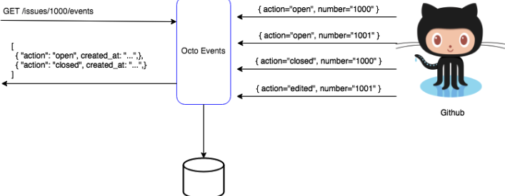
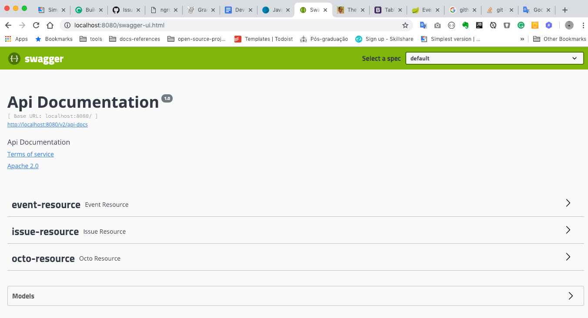
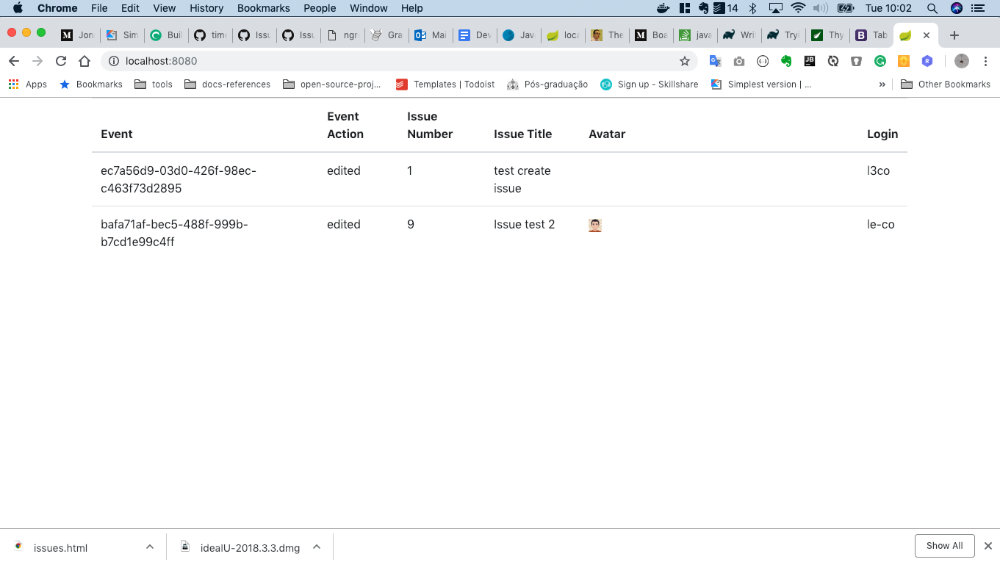

## Ocot Api - Kotlin

#### About Octo

Octo Events is an application that listens to Github Events via webhooks and expose by an api for later use.



#### About Project

This project exposes the events received from the webhook configured in github. 

#### Dependencies

> Kotlin 

> Spring Boot

> Postgres

> ngrok

#### How do you build project

> With gradle wrapper

```shell
$ ./gradlew build
```

> With gradle local

```shell
$ gradle build
```

#### How do you run 

> With gradle wrapper

```shell
$ ./gradlew bootRun
```

> With gradle local

```shell
$ ./gradlew bootRun
```

> From jar file

```shell
$ java -jar kotlin-octo-0.0.1-SNAPSHOT.jar
```

#### Check Service

> With cURL

 ```shell
 $ curl -X GET http://localhost:8080/actuator/health -H 'cache-control: no-cache'
 ```
  
> Or open browser and paste http://localhost:8080/actuator/health
 
#### Documentation 
 
> Open browser and paste http://localhost:8080/swagger-ui.html



#### Show All Issues Created 
 
> Open browser and paste http://localhost:8080



